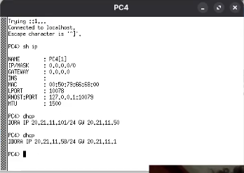
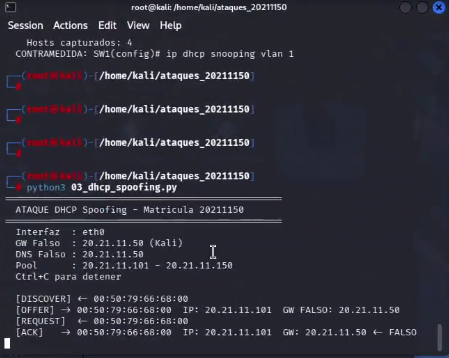
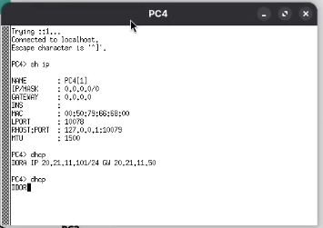
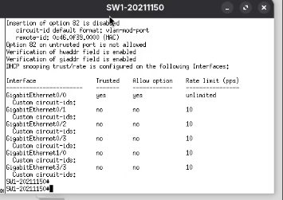
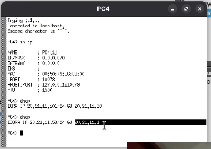

# DHCP-Spoofing-20211150
# Ataque DHCP Spoofing — Matrícula 20211150
**Autor:** Alvaro Smilk Baez Tavera
**Matrícula:** 20211150
**Fecha:** 3 Junio 2026

---

## Descripción
Script que implementa un servidor DHCP rogue (falso) que 
responde peticiones DHCP antes que el servidor legítimo, 
entregando configuración de red falsa a las víctimas con 
Kali Linux como gateway y servidor DNS.

---

## Objetivo
Demostrar la vulnerabilidad del protocolo DHCP ante 
ataques de suplantación de servidor, redirigiendo el 
tráfico de las víctimas hacia el atacante y aplicando 
las contramedidas necesarias.

---

## Topología
Router-20211150 (20.21.11.1) ← DHCP legítimo
|
SW1-20211150 (20.21.11.2)
/        
Kali Linux    PC1/PC2/PC3
(20.21.11.50) (Víctimas)
DHCP ROGUE

## Direccionamiento
| Dispositivo | IP          | Interfaz | Rol           |
|-------------|-------------|----------|---------------|
| Router      | 20.21.11.1  | gi0/0    | DHCP legítimo |
| SW1         | 20.21.11.2  | gi0/0    | Switch        |
| Kali Linux  | 20.21.11.50 | gi3/3    | DHCP Rogue    |
| PC1         | DHCP        | gi0/1    | Víctima       |
| PC2         | DHCP        | gi0/2    | Víctima       |
| PC3         | DHCP        | gi0/3    | Víctima       |

---

## Requisitos
- Python 3
- Scapy instalado
- Privilegios root
- Puerto 67/68 UDP disponible
- DHCP Snooping desactivado en el switch

### Instalación
```bash
pip3 install scapy --break-system-packages
```

---

## Parámetros del script
| Parámetro    | Valor            | Descripción                  |
|--------------|------------------|------------------------------|
| INTERFAZ     | eth0             | Interfaz del atacante        |
| ROGUE_GW     | 20.21.11.50      | Gateway falso (Kali)         |
| ROGUE_DNS    | 20.21.11.50      | DNS falso (Kali)             |
| ROGUE_MASCARA| 255.255.255.0    | Máscara entregada            |
| POOL_INICIO  | 20.21.11.101     | Inicio del pool rogue        |
| POOL_FIN     | 20.21.11.150     | Fin del pool rogue           |
| ROGUE_LEASE  | 3600             | Tiempo de lease en segundos  |

---

## Uso
```bash
# Básico:
sudo python3 03_dhcp_spoofing.py

# Especificar interfaz:
sudo python3 03_dhcp_spoofing.py eth0
```

---

## Funcionamiento
1. Escucha peticiones DHCP DISCOVER en broadcast
2. Responde con DHCP OFFER antes que el router:
   - IP del pool rogue (20.21.11.101-150)
   - Gateway = 20.21.11.50 (Kali)
   - DNS = 20.21.11.50 (Kali)
3. Cuando la víctima envía REQUEST responde con ACK
4. La víctima queda configurada con datos falsos
5. Todo el tráfico de la víctima pasa por Kali

### Flujo DHCP Rogue
PC Víctima  →  DISCOVER  →  [broadcast]
Kali        →  OFFER     →  PC (antes que el router)
PC Víctima  →  REQUEST   →  Kali
Kali        →  ACK       →  PC (configuración falsa)

---

## Verificación del ataque
```bash
# En PC víctima:
dhcp
show ip
# GATEWAY debe ser 20.21.11.50 (Kali)

# En Kali ver hosts capturados:
# El script muestra en pantalla:
# [DISCOVER] <- mac_victima
# [OFFER]    -> mac_victima  IP: 20.21.11.101
# [ACK]      -> mac_victima  GW: 20.21.11.50
```

---

## Capturas
### Antes del ataque — DHCP legítimo


### Script corriendo en Kali


### PC víctima recibe GW falso


### Servidor rogue respondiendo


---

## Contramedida
```bash
# En SW1 — DHCP Snooping:
SW1-20211150(config)# ip dhcp snooping
SW1-20211150(config)# ip dhcp snooping vlan 1
SW1-20211150(config)# no ip dhcp snooping information option
SW1-20211150(config)# interface gi0/0
SW1-20211150(config-if)# ip dhcp snooping trust
SW1-20211150(config-if)# exit
SW1-20211150(config)# interface range gi0/1-3
SW1-20211150(config-if)# ip dhcp snooping limit rate 10
SW1-20211150(config-if)# exit
SW1-20211150(config)# interface gi3/3
SW1-20211150(config-if)# ip dhcp snooping limit rate 10
SW1-20211150(config-if)# exit
SW1-20211150(config)# end
SW1-20211150# write memory

# Verificar:
SW1-20211150# show ip dhcp snooping
SW1-20211150# show ip dhcp snooping statistics
```

### Resultado con contramedida activa
PC víctima pide IP:
dhcp
show ip
GATEWAY: 20.21.11.1 ← router legítimo ✓

### Verificación contramedida


---

## Video
[Ver demostración en YouTube](https://youtu.be/wNN2LNqnkAk?si=rHeu-54ijV-vG7Ae)

---

## Referencias
- RFC 2131: DHCP Protocol
- Cisco DHCP Snooping Configuration Guide
- Herramienta: Python 3 + Scapy
